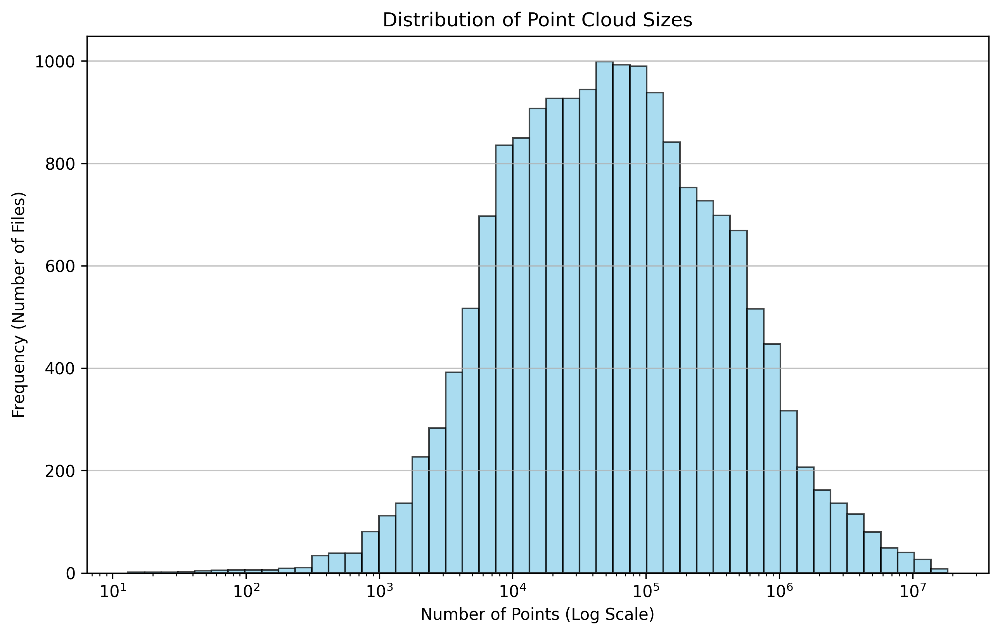
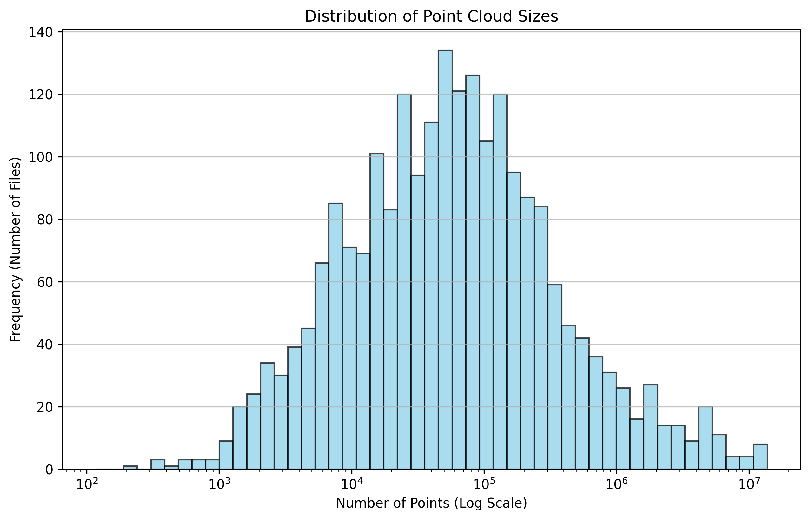
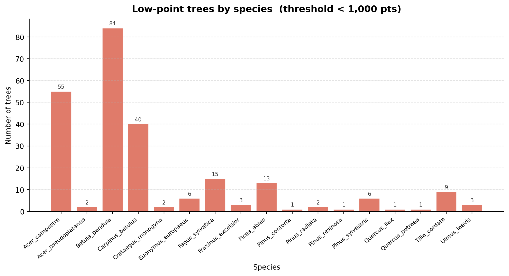

# FORTLSppClass
## Tree species classification from gound-based LiDAR
This workflow classifies tree species from cross-section images of individual tree point clouds using a YOLOv5 image classification model. The script TreeProjection.py generates four 640×640 px cross-section images for each input LAS/LAZ file, rendered from four viewing angles: 0°, 45°, 90°, and 135°.
## Installation

1. Clone the repository:
```bash
git clone https://github.com/Molina-Valero/FORTLSppClass.git
cd FORTLSppClass
```

2. Create a virtual environment (optional):
```bash
python -m venv venv
source venv/bin/activate  # On Windows: venv\Scripts\activate
```

3. Install PyTorch separately BEFORE running `pip install -r requirements.txt`.

   Choose ONE of the commands below depending on your setup and CUDA version:
    - CPU-only: pip install torch --index-url https://download.pytorch.org/whl/cpu
    - CUDA 12.x (replace 12.8 with your CUDA version): pip install torch --index-url https://download.pytorch.org/whl/cu128

4. Install the rest of the dependencies:
```bash
pip install -r requirements.txt
```

## Usage

TODO


# Tree projections
```bash
python TreeProjection.py <input_path> <output_path> [n_workers] [canvas_size] [dpi] # Alessia
python TreeProjection_JAMV.py <input_path> <output_path> [n_workers] [angles] # Juan
python TreeProjection_features.py <input_path> <output_path> [n_workers] [angles] [search_radius] [feature] # Juan
```

### Arguments:
- `input_path`: Directory containing `.las` or `.laz` files (flat or nested structure)
- `output_path`: Directory where projected images will be saved
- `n_workers`: Number of parallel processes (optional)
- `canvas_size`: Size (in pixels) of output square image (default: 1024)
- `dpi`: Resolution in dots per inch (default: 300)
- `angles`: Generates projections at multiple angles (default: 0°, 45°, 90°, 135°)
- `search_radius`: Implemented radius to calculate geometric features (default: 0.2)
- `feature`: Geometric feature (default: "verticality")


**Examples:**
```bash
python TreeProjection.py "data/input" "data/output" 4 1024 300
python TreeProjection_JAMV.py "data/input" "data/output" 4 (0, 45, 90, 135)
python TreeProjection_features.py "data/input" "data/output" 4 (0, 45, 90, 135) 0.2 "verticality"
```
Each processed LAS/LAZ file produces four grayscale PNG images, named `<filename>_<angle>.png`, placed in the specified output directory.

## 📁 Output Format
- PNG images (square canvas)
- Size controlled by `canvas_size`
- Centered and padded to avoid aspect-ratio distortion
- Normalized point intensity for consistent brightness

## 🤖 Downstream Use
The images are formatted for training or inference with YOLO-based classification models. Images retain key structural traits of trees (crown shape, trunk taper) thanks to aspect-aware projection and padding.

## Features

- Processes LAS/LAZ point cloud files
- Generates projections at multiple angles (0°, 45°, 90°, 135°)
- Parallel processing support
- Automatic normalization based on highest point

## 📊 Classification Performance by Feature

Classification accuracy metrics for each geometric feature used in tree species identification, evaluated using a YOLOv5 model.
```bash
YOLO Image Classification Trainer
Usage:
  python train_classifier.py --data "C:/path/to/dataset" --model yolov8s-cls.pt --epochs 100 --imgsz 640 --batch 16 --name my_run
```

| Feature       | Precision (Top-1) | Precision (Top-5) |
|---------------|-------------------|-------------------|
| Verticality   |             0.7357|             0.9530|
| Sphericity    |             0.7174|             0.9530|
| Linearity     |             0.7377|             0.9526|
| Planarity     | -                 | -                 |

> Metrics computed on the test set. **Bold** values indicate best performance per column.

# Point cloud analysis
Exploration of the dataset

## Point cloud sizes

The number of points in the training and test sets is shown in the following histograms:

_Training set_


_Test set_



## Low-point clouds
The following table lists the number of point clouds with fewer than 1000 points.



