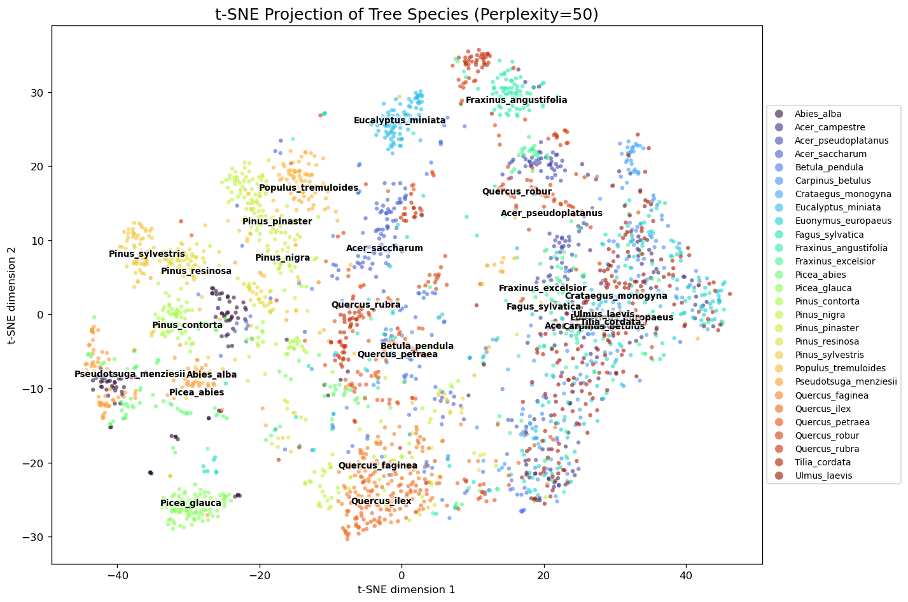
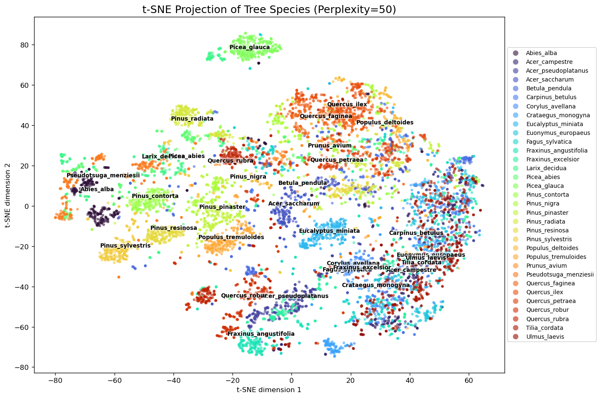
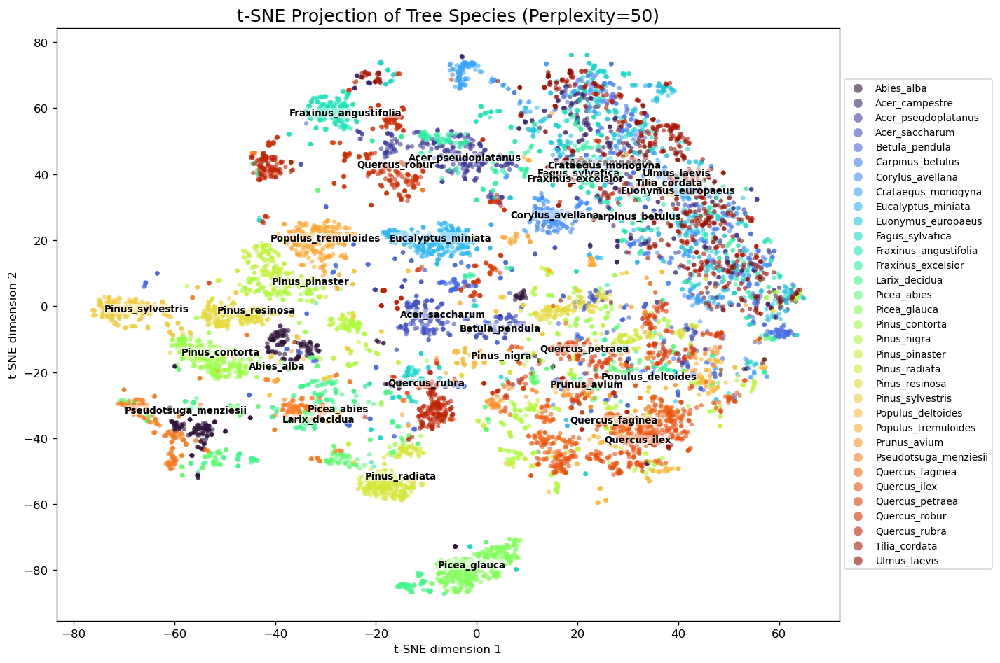
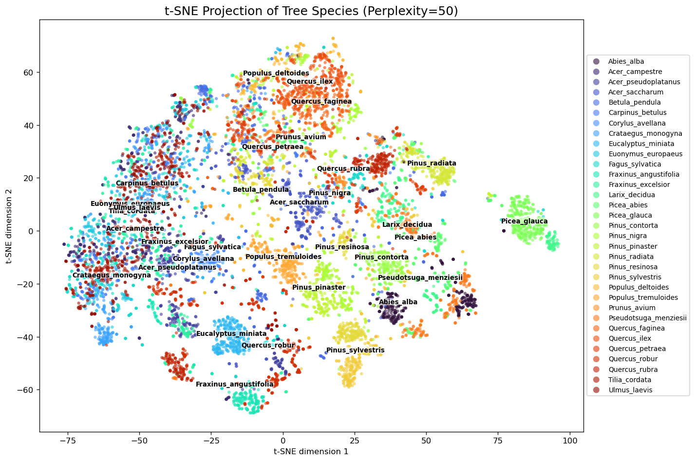
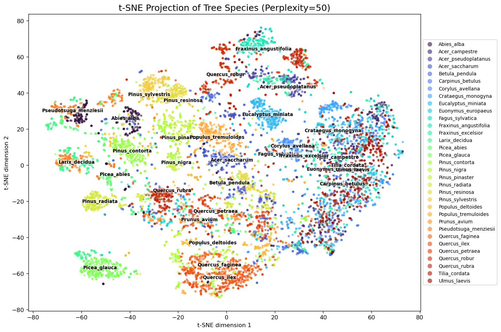
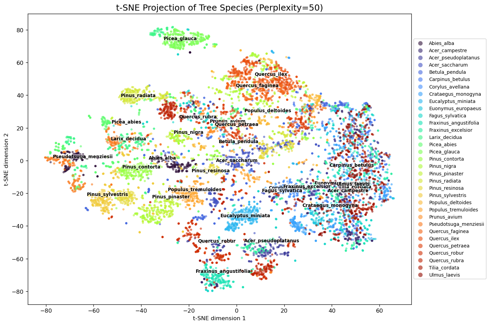

# Geometric feature embeddings

This folder contains images for the t-SNE visualizations of the embeddings of the different geometric features (e.g. linearity, anisotropy, planarity, etc.).
If available, classification results and top confounders using the embeddings are also included. 

All features obtained using DINO ViT-L and classified with Logistic Regression.

**Result summary:** The studied geometric features did not appear to improve the classification results or separability. 

Note that support for point density was smaller.

| Geometric feature | F1-score (macro) | Accuracy | Support |
|---|---:|---:|---:|
| Point density (standard) | 0.71 | 0.70 | 560 |
| Linearity | 0.75 | 0.75 | 2512 |
| Anisotropy | 0.76 | 0.76 | 2456 |
| Planarity | 0.75 | 0.75 | 2476 |
| Sphericity | 0.75 | 0.75 | 2512 |
| Surface variation | 0.75 | 0.75 | 2512 |

## Point density (standard)

Note: Support (i.e samples) not as big as in the following experiments.

|              | precision | recall | f1-score | support |
|--------------|-----------|--------|----------|---------|
| accuracy     |           |        | 0.70     | 560     |
| macro avg    | 0.71      | 0.71   | 0.71     | 560     |
| weighted avg | 0.71      | 0.70   | 0.70     | 560     |

## Linearity

|                  | Precision | Recall | F1-score | Support |
|------------------|-----------|--------|----------|---------|
| **Accuracy**     |           |        | 0.75     | 2512    |
| **Macro avg**    | 0.76      | 0.75   | 0.75     | 2512    |
| **Weighted avg** | 0.76      | 0.75   | 0.75     | 2512    |

| True Class         | Predicted As        | Error Rate |
|--------------------|---------------------|------------|
| Prunus_avium       | Quercus_petraea     | 34.4%      |
| Carpinus_betulus   | Ulmus_laevis        | 23.8%      |
| Fraxinus_excelsior | Acer_pseudoplatanus | 17.5%      |
| Crataegus_monogyna | Carpinus_betulus    | 15.0%      |
| Carpinus_betulus   | Acer_campestre      | 13.8%      |

## Anisotropy

|                  | Precision | Recall | F1-score | Support |
|------------------|-----------|--------|----------|---------|
| **Accuracy**     |           |        | 0.76     | 2456    |
| **Macro avg**    | 0.77      | 0.76   | 0.76     | 2456    |
| **Weighted avg** | 0.77      | 0.76   | 0.76     | 2456    |

| True Class         | Predicted As        | Error Rate |
|--------------------|---------------------|------------|
| Prunus_avium       | Quercus_petraea     | 31.2%      |
| Carpinus_betulus   | Ulmus_laevis        | 22.5%      |
| Carpinus_betulus   | Acer_campestre      | 18.8%      |
| Fraxinus_excelsior | Acer_pseudoplatanus | 18.8%      |
| Ulmus_laevis       | Acer_campestre      | 15.6%      |

## Planarity

|                  | Precision | Recall | F1-score | Support |
|------------------|-----------|--------|----------|---------|
| **Accuracy**     |           |        | 0.75     | 2476    |
| **Macro avg**    | 0.75      | 0.75   | 0.75     | 2476    |
| **Weighted avg** | 0.75      | 0.75   | 0.75     | 2476    |

| True Class         | Predicted As          | Error Rate |
|--------------------|-----------------------|------------|
| Carpinus_betulus   | Ulmus_laevis          | 25.0%      |
| Picea_abies        | Pseudotsuga_menziesii | 20.0%      |
| Fraxinus_excelsior | Acer_pseudoplatanus   | 18.8%      |
| Prunus_avium       | Quercus_petraea       | 18.8%      |
| Tilia_cordata      | Euonymus_europaeus    | 18.8%      |

## Sphericity

|                  | Precision | Recall | F1-score | Support |
|------------------|-----------|--------|----------|---------|
| **Accuracy**     |           |        | 0.75     | 2512    |
| **Macro avg**    | 0.76      | 0.75   | 0.75     | 2512    |
| **Weighted avg** | 0.75      | 0.75   | 0.75     | 2512    |

| True Class         | Predicted As       | Error Rate |
|--------------------|--------------------|------------|
| Prunus_avium       | Quercus_petraea    | 25.0%      |
| Tilia_cordata      | Ulmus_laevis       | 21.2%      |
| Carpinus_betulus   | Ulmus_laevis       | 18.8%      |
| Crataegus_monogyna | Euonymus_europaeus | 17.5%      |
| Euonymus_europaeus | Acer_campestre     | 17.5%      |

## Surface variation

|                  | Precision | Recall | F1-score | Support |
|------------------|-----------|--------|----------|---------|
| **Accuracy**     |           |        | 0.75     | 2512    |
| **Macro avg**    | 0.75      | 0.75   | 0.75     | 2512    |
| **Weighted avg** | 0.75      | 0.75   | 0.75     | 2512    |

| True Class         | Predicted As       | Error Rate |
|--------------------|--------------------|------------|
| Prunus_avium       | Quercus_petraea    | 31.2%      |
| Tilia_cordata      | Ulmus_laevis       | 22.5%      |
| Crataegus_monogyna | Euonymus_europaeus | 21.2%      |
| Euonymus_europaeus | Acer_campestre     | 20.0%      |
| Carpinus_betulus   | Tilia_cordata      | 18.8%      |
