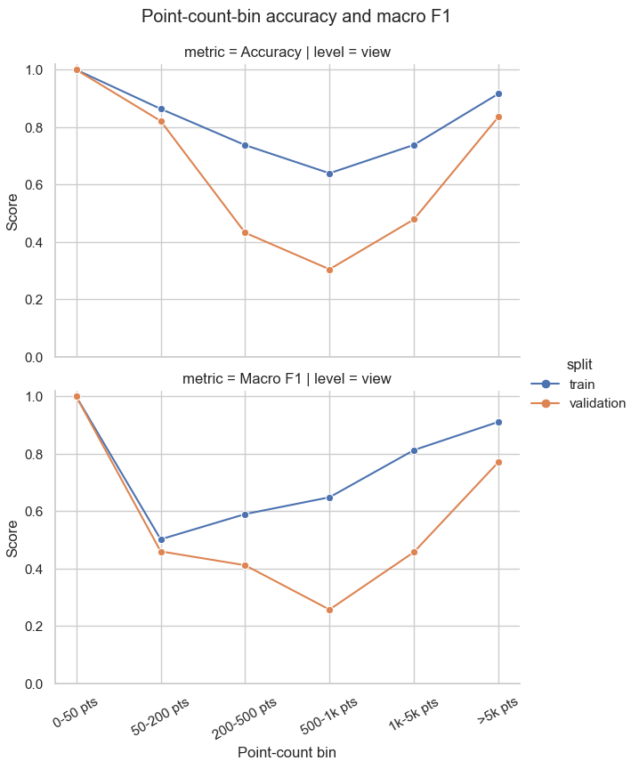

# Point cloud analysis
Exploring the performance of the models based on the number of points in the point cloud.

## Point cloud sizes

The number of points in the training and test sets is shown in the following histograms:

_Training set_

_Test set_

## Low-point clouds
The following table lists the number of point clouds with fewer than 1000 points.

## Point count performance analysis

Evaluate predictions by point-cloud sparsity. We bin the point clouds into the following ranges:

- `0-50 pts`
- `50-200 pts`
- `200-500 pts`
- `500-1k pts`
- `1k-5k pts`
- `>5k pts`

Number of trees in each bin

| point_count_bin | n_trees |
| :-------------- | ------: |
| 0-50 pts        |       6 |
| 50-200 pts      |      29 |
| 200-500 pts     |      70 |
| 500-1k pts      |     139 |
| 1k-5k pts       |    1429 |
| >5k pts         |   16034 |

For each bin we compute the accuracy and macro-F1 score. Interestingly, the problem does not seem to be in the lowest bin, but in the middle ones.

