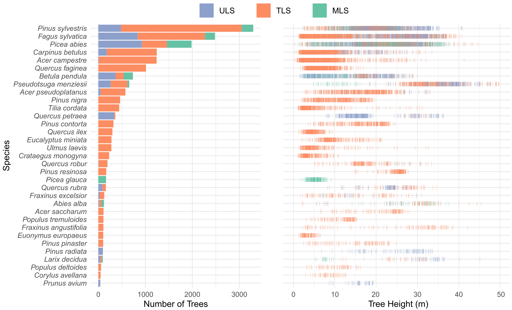
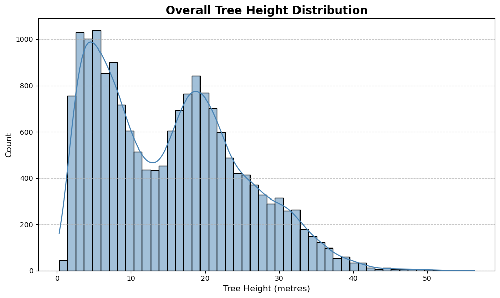
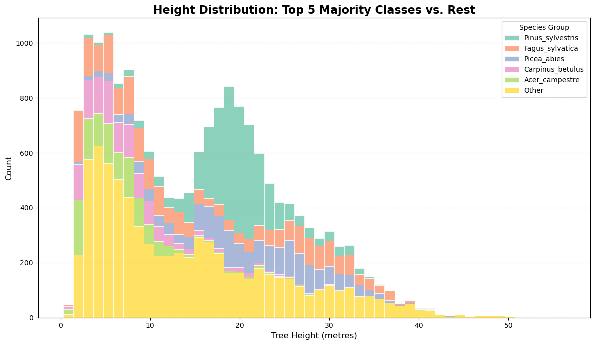
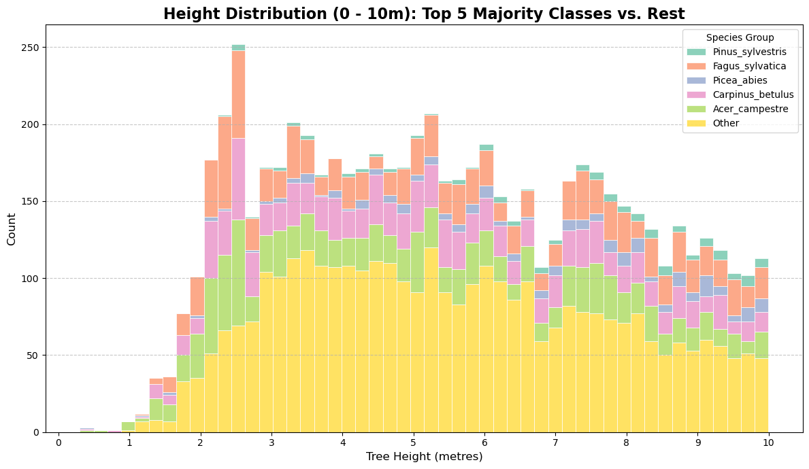
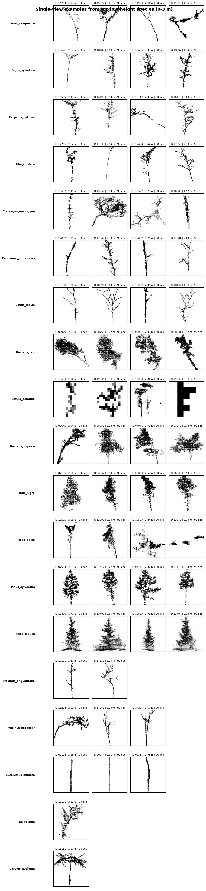

# Tree Height Analysis

This page summarises exploratory analysis of tree height in the dataset.

Height is obtained from the z-range stored in the `.las` point cloud metadata. 

**Summary:** TBD

## Species and heights

The plot below, provided by the organisers, shows the number of samples per species and their associated height distribution.

Basic exploratory analysis of tree height shows:

| Metric | Value |
|---|---:|
| Median height | 15.00 m |
| Mean height | 15.26 m |
| Trees < 5 m | 3,040 |
| Trees 0-10 m | 6,761 |
| Trees > 30 m | 1,476 |

For the most common classes:

| Species | Samples | Median height |
|---|---:|---:|
| `Pinus_sylvestris` | 3,296 | 19.50 m |
| `Fagus_sylvatica` | 2,482 | **13.41 m** |
| `Picea_abies` | 1,983 | 21.09 m |
| `Carpinus_betulus` | 1,243 | **6.40 m** |
| `Acer_campestre` | 1,240 | **5.82 m** |

## Overall Height Distribution

The plot below shows the overall height distribution across the dataset.

The distribution appears to have two main modes: one around 5 m and another around 20 m.

## Height Distribution by Species

Among the five majority classes, three species have substantial representation in the 0-10 m range:

- `Fagus_sylvatica`
- `Carpinus_betulus`
- `Acer_campestre`

This is visible in the stacked histogram below:

Zoomed in on 0-10 range:

## Low-Height Tree Examples?

Here is plot showing a lot of trees in the 0-3 meter range.

These samples suggest that many low-height trees are sparse, low-detail renderings, often dominated by stems or small branch fragments.

